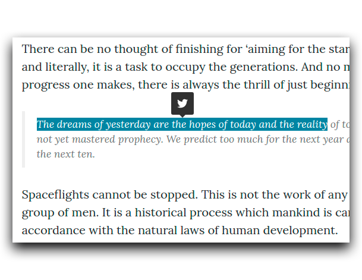
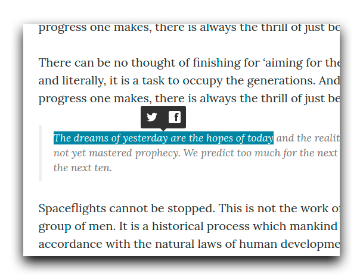
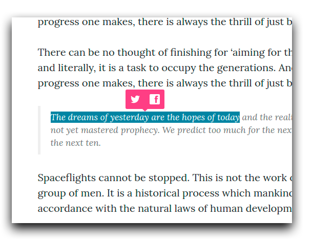

<p align="center">
  <a href="https://estevanmaito.github.io/sharect"></a>
</p>

<p align="center">
  <a href="https://www.npmjs.com/package/sharect"></a>
  <a href="https://github.com/estevanmaito/sharect/releases/download/v1.0.2/sharect.min.js"></a>
  <a href="https://github.com/estevanmaito/sharect"></a>
</p>

A **lightweight** (3.7kb, 1.6kb gziped) JavaScript library to let users share their text selections to social networks, in desktop browsers. (Yes, like Medium)

[Watch it live.](https://estevanmaito.github.io/sharect)

## Packages

| Package | Version | Description |
|---------|---------|-------------|
|sharect|<a href="https://www.npmjs.com/package/sharect"></a>|No dependencies, plug-n-play|
|sharect-react|Soon|React.js plugin|

## Usage

### NPM

```
npm install sharect
```

### Script

[Download](https://github.com/estevanmaito/sharect/releases/download/v1.0.1/sharect.min.js)

Add the script to the project and initialize

```html
<script src="sharect.min.js"></script>
<script>
  var sharect = new Sharect();
  sharect.init();
</script>
```

More use cases below.

## Docs

### API settings

Property | Default | Type | Description
-- | -- | -- | --
`twitter` | `true` | `boolean` | If Twitter should show in tooltip
`facebook` | `false` | `boolean` | If Facebook should show in tooltip. [Read more](#facebook-share) about configuring Facebook.
`twitterUsernmae` | `""` | `string` | The username that should be cited when shared, begining with `@`
`backgroundColor` | `#333333` | `string` | The background color of the tooltip. Can be any valid CSS color name
`iconColor` | `#FFFFFF` | `string` | The color of the icons in the tooltip. Can be any valid CSS color name
`selectableElements` | `['body']` | `array` | Define the elements that can be selected, including it's children. **It expects a valid selector string** like `['p', '.article', '#main']`

### Minimum example

```html
  ...
  <script src="sharect.min.js"></script>
  <script>
    var sharect = new Sharect();
    sharect.init();
  </script>
</body>
```

Result



### Facebook share

If you want Facebook share to work, first you will need to add the JavaScript SDK **before** Sharect's script initialization. Read more about [Facebook Share SDK](https://developers.facebook.com/docs/javascript/quickstart#loading).

```html
  ...
  <!-- BEGIN: Facebook JavaScript SDK -->
  <script>
    window.fbAsyncInit = function() {
      FB.init({
        appId      : 'YOUR-APP-ID',
        xfbml      : true,
        version    : 'v2.8'
      });
      FB.AppEvents.logPageView();
    };

    (function(d, s, id){
      var js, fjs = d.getElementsByTagName(s)[0];
      if (d.getElementById(id)) {return;}
      js = d.createElement(s); js.id = id;
      js.src = "https://connect.facebook.net/en_US/sdk.js";
      fjs.parentNode.insertBefore(js, fjs);
    }(document, 'script', 'facebook-jssdk'));
  </script>
  <!-- END: Facebook JavaScript SDK -->
  <script src="sharect.min.js"></script>
  <script>
    var sharect = new Sharect();
    sharect.config({
      facebook: true
    }).init();
  </script>
</body>
```

Result



### Complete API

Assuming you already added the above Facebook SDK script.

```html
  ...
  <script src="sharect.min.js"></script>
  <script>
    var sharect = new Sharect();
    sharect.config({
      facebook: true,
      twitter: true,
      twitterUsername: '@estevanmaito',
      backgroundColor: '#ff4081',
      iconColor: '#fff',
      selectableElements: ['p', '.header', 'blockquote']
    }).init();
  </script>
</body>
```

Note that ```twitter``` is ```true``` by default, as ```iconColor``` is ```#ffffff```. This example just exposes the available API.

Result



## Contributing

Please, read the [CONTRIBUTING.md](CONTRIBUTING.md).